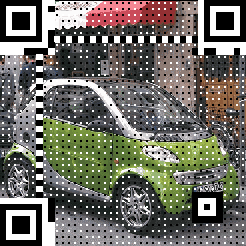
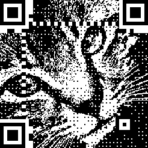

# HTQRCodeGen

This is a simple Python script that applies dithering to images before embedding them into QR Codes. The script converts an input image into a black-and-white dithered version, then integrates it into a scannable QR Code.

<p align="center">
  
  
</p>

## Features

- Converts images to black-and-white using dithering (Floyd-Steinberg or other methods)
- Generates colorful QR Codes
- Embeds dithered images into QR Codes
- Generates scannable QR Codes

## Requirements

- Python 3.x
- `pillow` 
- `segno` 
- `customtkinter` 
- `numpy`
- `darkdetect`

You can install dependencies using:

```bash
pip install -r requirements.txt
```

## Usage

Run the script with:

```bash
python main.py
```

## License

This project is licensed under the MIT License.